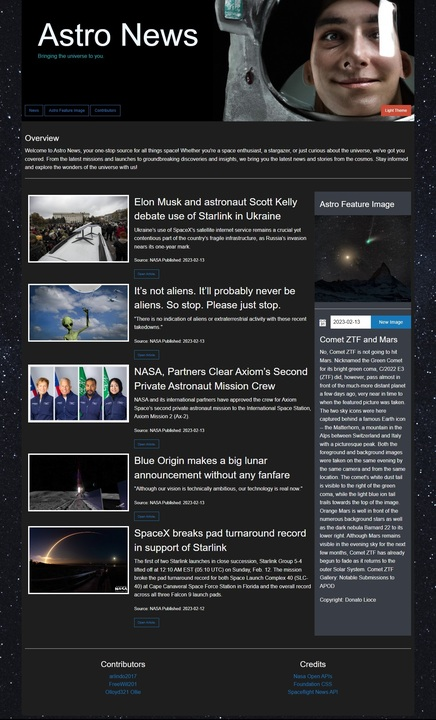

# Astro News API Call Project

# Link to Webpage

https://freewill201.github.io/Space-Repo/

# Link to Repo

https://github.com/FreeWill201/Space-Repo

# Link to Presentation

https://docs.google.com/presentation/d/1D1BdhwPlKTTMl4lU56mPke3sOYZycvsCtTnqeYkjTBk/edit#slide=id.g20876d9e232_0_26

# Picture Of Webpage

- 

# Description 

Our webpage delivers content about the universe through the lens of Nasa Images and SpaceNews Articles. Each image, available to be selected from any day from present to past starting with when available images were posted offers the image itself and a description of it. There is an accessible calendar UI made available  in the image section located on the right side of the webpage where the date can be selected. When the image is hovered over and clicked it enlarges to give a bigger and clearer view of it. On the left side of the webpage are the articles, five in total, that are the most recent for Space Enthusiasts who want to dig deeper on the most current news on all things space related. Each article has a link, made available through a button. Each article has a summary, date published, title, and the image associated with the article's header. Furthermore the user of the webpage can even select a dark or light theme for the page depending on their preference made avaiable through a dark or light selector button towards the top right of the webpage. Our page will successfully keep someone who is interested in topics related to the universe occupied and intrigued. 

# Installation 

The webpage is brought together by two API Call's made available through Nasa and SpaceNews. As stated in the description the Nasa API Call and rendering delivers an image along with all that accompanies it. The second API Call through SpaceNews delivers the articles to the webpage along with all that accompanies them through it's rendering. VS Code is what made it possible to write the code and analyze pull's and preform pushes to GitHub. Github is where we were able to deploy the webpage and resolve any conflicts via different branches before merging them together. If one is curious as to how our code was rendered they can view our work in more detail on our repo which displays our process step by step from a coding perspective.

# Usage 

The page is designed to allow someone to get a feel of Nasa's history through avaiable images and see how far we've come if they seek to compare and contrast present and past. The page is also designed to allow someone to get the most up to date news on all things space related. As previously stated this page is for Space Enthusiasts and accomplishes it's purpose very well for that specific demographic. 

# Credits

Credits to Foundation, CSS, Jquery, Day.js, and Jquery Ui. Furthermore the page could not work without both Nasa's and SpaceNews's API availability. We also thank Full Stack, Google, Youtube, Github, and VS Code for making it possible to render our webpage as a fully finished product that accomplishes it's aims.

# License 

MIT License 

# Features

Page has a fully interactive UI Calendar Feature that allows the user to select a specific date and receive back an image with a description of it. Also the image can be clicked on to enlarge it. Page display's five of the most recent articles from SpaceNews's Site each with a title, link, summary, article title related image and date published. Page also gives the user a choice of light or dark themes when viewing the webpage. 

